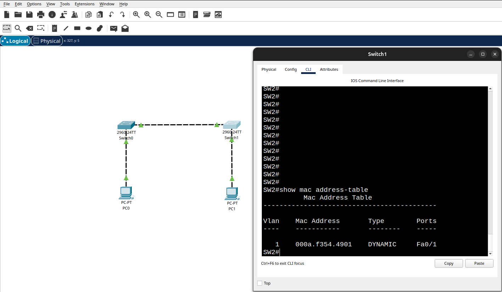
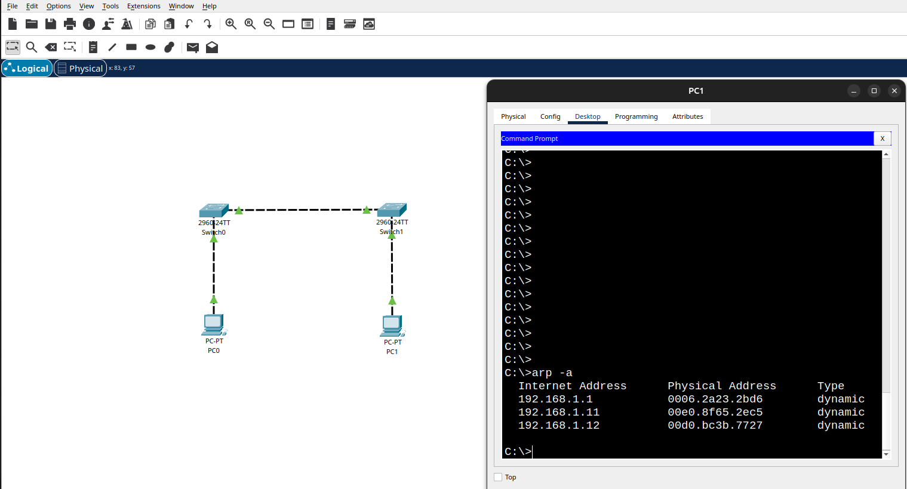

# Лабораторная работа. Просмотр таблицы MAC-адресов коммутатора    

## Топология:  
  

## Таблица адресации:  

    | Device  | Interface | IP-address/prefix         |
    | ------- | --------- | ------------------------- |
    | SW1     | VLAN 1    | 192.168.1.11 ip address   |
    |         |           | 255.255.255.0 mask        | 
    | ------- | --------- | ------------------------- |
    | SW2     | VLAN 1    | 192.168.1.12 ip address   |
    |                     | 255.255.255.0 mask        |
    | ------- | --------- | ------------------------- | 
    | PC-A    | NIC       | 192.168.1.1 ip address    |
    |         |           | 255.255.255.0 mask        |
    | ------- | --------- | ------------------------- | 
    | PC-B    | NIC       | 192.168.1.2 ip address    |
    |         |           | 255.255.255.0 mask        |
  

## Последовательность настройки коммутатора cisco 2960:  

1. Задать имя сетевого устройства:  
`enable`  
`config terminal`  
`hostname SW1/SW2`  

2. Защита устройства и первичная настройка для возможности удаленного доступа:  
`line con 0` (Защита консольного подключения)  
`password cisco`  
`login`    
`end`  

`configure terminal` (Защита рут режима)  
`enable secret class`  
`exit`  

`configure terminal`  
`line vty 0 4` (Добавляем 5 виртуальных терминалов с паролем для удаленного подлючения)  
`password cisco`  
`login`  
`transport input telnet` (Включаем службу telnet на свиче)  
`end`

`configure terminal`  
`service password-encryption` (Шифрование паролей - проверить можно командой show running-config)  
`exit` 

3. Настройка виртуальго интерфейса коммутарора:  
`configure terminal`  
`interface vlan 1`  
`ip address 192.168.1.11 255.255.255.0`      
`no shutdown`  

4. Общие настройки для удобства работы:  
`configure terminal`  
`no ip domain-lookup` (Маршрутизатор или коммутатор перестает отправлять запросы на разрешение имен в DNS-серверы)  
`line con 0`  
`logging synchronous` (Чтобы консольные сообщения не прерывали выполнение команд)   

5. Сохранение текущей конфигурации в энергонезависимую память nvram в рут режиме:  
`enable`  
`copy running-config startup-config`  

## Шаг 1. Запишите МАС-адреса сетевых устройств.  

a. Откройте командную строку на PC-A и PC-B и введите команду ipconfig /all.  
Открытие окна командной строки Windows  
Вопрос:  
Назовите физические адреса адаптера Ethernet.  
`MAC-адрес компьютера PC-A: 0006.2A23.2BD6`    
`MAC-адрес компьютера PC-B: 0060.2F23.5657`    
Закройте окно командной строки.  

b. Подключитесь к коммутаторам S1 и S2 через консоль и введите команду show interface F0/1 на каждом коммутаторе.  
Откройте окно конфигурации  
Вопросы:  
Назовите адреса оборудования во второй строке выходных данных команды (или зашитый адрес — bia).  
`МАС-адрес коммутатора S1 Fast Ethernet 0/1: 000a.f354.4901`  
`МАС-адрес коммутатора S2 Fast Ethernet 0/1: 00e0.f94a.3a01`  

##  Шаг 2. Просмотрите таблицу МАС-адресов коммутатора.  
Подключитесь к коммутатору S2 через консоль и просмотрите таблицу МАС-адресов до и после тестирования сетевой связи с помощью эхо-запросов.  

a. Подключитесь к коммутатору S2 через консоль и войдите в привилегированный режим EXEC.  
Откройте окно конфигурации  

b. В привилегированном режиме EXEC введите команду show mac address-table и нажмите клавишу ввода.    

`S2# show mac address-table`  

Даже если сетевая коммуникация в сети не происходила (т. е. если команда ping не отправлялась), коммутатор может узнать МАС-адреса при подключении к ПК и другим коммутаторам.  
Вопросы:  
Записаны ли в таблице МАС-адресов какие-либо МАС-адреса?   
`Да`  
Какие МАС-адреса записаны в таблице? С какими портами коммутатора они сопоставлены и каким устройствам принадлежат? Игнорируйте МАС-адреса, сопоставленные с центральным процессором.  
`Мак адреса ближайших устройств — компьютера и свича`      
Если вы не записали МАС-адреса сетевых устройств в шаге 1, как можно определить, каким устройствам принадлежат МАС-адреса, используя только выходные данные команды show mac address-table? Работает ли это решение в любой ситуации?  
`У нас есть информация о физическом порте, если мы обладаем информацией о том какое устройство подсоединено к этому порту, то информации из таблицы нам хватит. Кроме ситуаций, когда мак-адреса оконечных устройств часто меняются или просто динамически меняются.`    

## Шаг 3. Очистите таблицу МАС-адресов коммутатора S2 и снова отобразите таблицу МАС-адресов.  

a. В привилегированном режиме EXEC введите команду clear mac address-table dynamic и нажмите клавишу Enter.  
`S2# clear mac address-table dynamic`  

b. Снова быстро введите команду show mac address-table.  
Вопросы:  
Указаны ли в таблице МАС-адресов адреса для VLAN 1? Указаны ли другие МАС-адреса?  
`Нет`  
Через 10 секунд введите команду show mac address-table и нажмите клавишу ввода. Появились ли в таблице МАС-адресов новые адреса?  
`Нет, появился только один адрес соседнего свича. (ранее адрес компьютера появился потому что было осуществлено подключение по телнет)`  

## Шаг 4. С компьютера PC-B отправьте эхо-запросы устройствам в сети и просмотрите таблицу МАС-адресов коммутатора.  

a. На компьютере PC-B откройте командную строку и еще раз введите команду arp -a.  
Откройте командную строку.  
Вопрос:  
Не считая адресов многоадресной и широковещательной рассылки, сколько пар IP- и МАС-адресов устройств было получено через протокол ARP?  
`Один адрес — мак адрес интерфейса влан 18 на свиче`  

b. Из командной строки PC-B отправьте эхо-запросы на компьютер PC-A, а также коммутаторы S1 и S2.  
Вопрос:  
От всех ли устройств получены ответы? Если нет, проверьте кабели и IP-конфигурации.  
`Да, от всех устройств получены ответы, в выводе команды arp -a три айпи-адреса и три мак-адреса`  
Закройте командную строку.  

c. Подключившись через консоль к коммутатору S2, введите команду show mac address-table.  
Откройте окно конфигурации  
Вопрос:  
Добавил ли коммутатор в таблицу МАС-адресов дополнительные МАС-адреса? Если да, то какие адреса и устройства?  
`Три мак-адреса по интерфейсу F0/1 — два от свича и один от компьютера.`  
На компьютере PC-B откройте командную строку и еще раз введите команду arp -a.  
Вопрос:  
Появились ли в ARP-кэше компьютера PC-B дополнительные записи для всех сетевых устройств, которым были отправлены эхо-запросы?  
`Да, два мак-адреса свичей и один компьютера (PC-A)`  
Закройте командную строку.  

## Вопрос для повторения  
В сетях Ethernet данные передаются на устройства по соответствующим МАС-адресам. Для этого коммутаторы и компьютеры динамически создают ARP-кэш и таблицы МАС-адресов. Если компьютеров в сети немного, эта процедура выглядит достаточно простой. Какие сложности могут возникнуть в крупных сетях?  

`Увеличение времени составления таблицы, частое подключение-отключение оконечных устройств, временные мак-адреса, соответственно увеличенная нагрузка на оборудование.`  

## Скриншоты:  
>  SW2 до эхо-запросов:  
  

> PC-B после эхо-запросов к двум свичам и хосту PC-A:  
  

